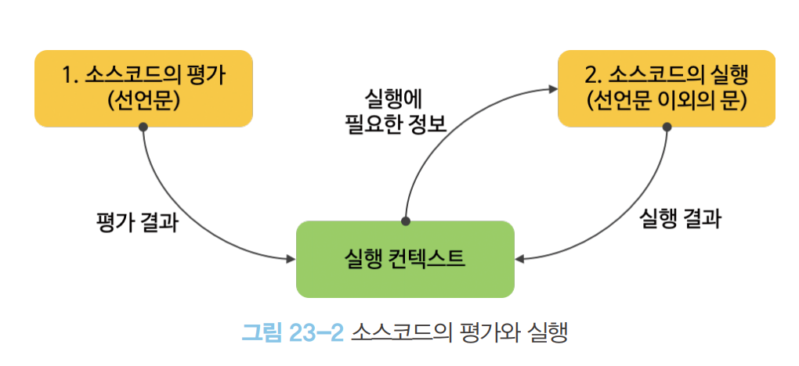

# 23. 실행 컨텍스트

> 자바스크립트의 동작 원리를 담고 있는 핵심 개념이다.

 

## 소스코드의 타입

- 소스코드를 4가지 타입으로 구분한다. 소스코드는 실행 컨텍스트를 생성
  | 소스코드의 타입 | 설명 |
  |-----------------|------|
  |전역 코드 | 전역에 존재하는 소스코드를 말한다. 전역에 정의된 함수, 클래스 등의 내부 코드는 포함되지 않는다.|
  |함수 코드 | 함수 내부에 존재하는 소스코드를 말한다. 함수 내부에 중첩된 함수. 클래스 등의 내부 코드는 포함되지 않는다.|
  |eval 코드 | 빌트인 전역 함수인 eval 함수에 인수로 전달되어 실행되는 소스코드를 말한다.|
  |모듈 코드 | 모듈 내부에 존재하는 소스코드를 말한다. 모듈 내부의 함수, 클래스 등의 내부 코드는 포함되지 않는다.|

#### 1. 전역 코드

전역 변수를 관리하기 위해 최상위 스코프인 `전역 스코프`를 생성해야 한다. 그리고 `var`키워드로 선언된 전역 변수와 함수 선언문으로 정의된 전역 함수를 전역 객체의 프로퍼티와 메서드로 바인딩하고 참조하기 위해 전역 객체와 연결되어야 한다. 이를 위해 전역 코드가 평가되면 전역 실행 컨텍스트가 생성됨.

#### 2. 함수 코드

지역 스코프를 생성하고 `지역 변수`, `매개변수`, `arguments` 객체를 관리해야 한다. 생성한 지역 스코프를 전역스코프에서 시작하는 `스코프 체인`의 일원으로 연결해야 한다. 이를 위해 함수 코드가 평가되면 함수 실행 컨텍스트가 생성됨.

#### 3. eval 코드

`strict mode`에서 자신만의 독자적인 스코프를 생성한다. 이를 위해 eval 코드가 평가 되면 eval 실행 컨텍스트가 실행된다.

#### 4. 모듈 코드

모듈별로 독립적인 모듈 스코프를 생성한다. 이를 위해 모듈 코드가 평가되면 모듈 실행 컨텍스트가 생성.

## 소스코드의 평가와 실행

> `소스코드의 평가`와 `소스코드의 실행` 과정으로 나누어 처리한다.

소스코드의 평가

1. 실행 컨텍스트를 생성

- 변수, 함수 등의 선언문만 먼저 실행하여 생성된 변수나 함수 식별자를 키로 실행 컨텍스트가 관리하는 스코프(렉시컬 환경의 환경 레코드)에 등록한다.

2. 소스코드 평가 과정이 끝나면 비로소 선언문을 제외한 소스코드가 순차적 실행.(런타임 시작)

- 실행에 필요한 정보, 변수나 함수의 참조를 실행 컨텍스트가 관리하는 스코프에서 검색해서 취득.
- 변수 값의 변경 등 소스코드의 실행 결과는 다시 실행 컨텍스트가 관리하고 스코프에 등록

 

