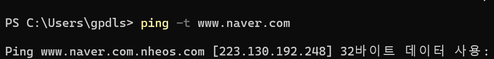

## 프런트엔드 개발자

> 처리한 데이터를 이용해 사용자 화면 구성
> +) 백엔드 : 서버 내부에서 데이터 처리

### 하는 일 7가지

- UI/UX 개발
- 재사용이 가능한 UI 개발
  - 앵귤러, React, View 등의 JavaScript framework 사용
- 애니메이션 구현
  - CSS
- 웹 사이트 성능 최적화
  - 로딩+반응 속도, 안정성등의 요소 개선
  - 웹 브라우저의 개발자도구 or Lighthouse, 웹 사이트 성능 측정 테스트 도구
  - 기술 : 캐싱, 압축, 이미지 최적화 등
- 디버깅 (오류를 찾아 수정하는 것)
- 테스트 코드 작성
- 다른 개발자와 협업

### 공부 해야할 것

1. 네트워크와 인터넷
   예로 DNS, IP, 도메인 네임

2. HTML, CSS, 자바스크립트
3. 심화기술
   - HTML 전처리기 (`함엘`, `슬림`, `퍼그`)
   - CSS 전처리기`SCSS` / 후처리기 `PostCSS`
   - CSS 방법론 `OOCSS`,`SMACSS`,`BEM`
   - 타입스크립트
4. 개발도구
   - 소스코드 에디터, 버전관리 시스템, 코드 포매터, 린터, 패키지 매니저, 모듈 번들러
5. 자바스크립트 프레임워크 `앵귤러, 리액트, 뷰` / CSS 프레임 워크 `부트스트랩, 테일윈드 CSS`
6. 네트워크 통신
7. API
8. TEST
9. 배포

<br>

## 네트워크와 인터넷

#### 일괄 처리 시스템

> 한 번에 하나의 작업만 처리

#### 시분할 시스템

> 시간을 쪼개 여러 사람이 컴퓨터 한 대를 사용

### 컴퓨터 네트워크

## 도메인과 DNS

#### IP 주소

> 컴퓨터와 컴퓨터를 네트워크로 연결 -> 위치를 식별할 수 있는 주소
> 

#### DNS

> Domain Name System 도메인 네임을 IP 주소로 변환

동작방식

1. 사용자가 웹 브라우저의 주소표시줄에 도메인 네임을 입력
2. DNS 서버가 이를 해석해 IP 주소 반환
3. 웹 브라우저가 IP 주소를 받아 IP 주소를 가진 컴퓨터에 접속

## HTML

> 시각적으로 rendring되는 UI 개발. = 표준 마크업 언어

#### 태그

- 일반 태그 : 의미 없는 일반적 텍스트 태그 (ex. <p></p>)
- 시맨틱 태그 : HTML5 유지보수 및 확장성을 위한 시각적인 효과 분리 (ex. <header>,<nav>)

#### 속성

> 태그로 나타내기 어려운 정보. 대표적으로 `<a>`

<a> 태그는 하이퍼텍스트

- `href` = 연결할 컨텐츠 경로 명시

```HTML
<a href="연결할 콘텐츠 경로">링크 제목</a>
```

- 글로벌 속성 : ex\_ `id`,`class`,`style`,`data-*`,`lang`

#### 문서의 기본 구조

```HTML
<!DOCTYPE html>
<html lang="en">
<head>
  <meta charset="UTF-8">
  <meta name="viewport" content="width=device-width, initial-scale=1.0">
  <title>Document</title>
</head>
<body>
</body>
</html>
```

#### 학습 방법

- 태그를 암기하려 하지 말기 - 실무에서 20여 가지 정도 사용하다 보면 익힘
- 태그를 정확히 알고 사용하기 - 어림짐작으로 하지 말고 검색으로 정확한 의미와 역할 파악
- 다양한 예제 코드 분석하기 - 암기와 적절하게 사용은 다른 것. 분석하고 배우는 자세
- 공식 문서와 온라인 자료 참고
  - HTML 리빙 스탠다드 : https://html.spec.whatwg.org/multipage/
  - MDN 기술 블로그 : https://developer.mozilla.org/ko/docs/Web/HTML

## CSS

#### 주요 특징

- 캐스케이딩 : 스타일 규칙이 한 개에 여러 개 일때 우선순위에 따라 스타일 적용 원칙

사용원리

1. 중요도 : CSS 속성 마지막에 `!important` 키워드
2. 명시성 : CSS의 선택자 selector가 얼마나 구체적인지 나타내는 값
   - 인라인 선택자 : 1000
   - 아이디 선택자 : 100
   - 클래스 + 가상 + 속성 선택자 : 10
   - 요소 + 가상요소 선택자 : 1
     명시성 값의 총합이 높은 스타일이 총합이 낮은 스타일보다 우선 적용
3. 작성순서

#### 상속

> 일반적으로 텍스트와 관련된 속성이 상속, 박스 모델과 관련된 속성은 상속X

#### 적용 방법

##### 내부 스타일 시트

```html
<head>
  <style>
    /* CSS 코드 */
  </style>
</head>
```

##### 외부 스타일 시트

```html
<head>
  <link rel="stylesheet" href="style.css" />
</head>
```

##### 인라인 스타일 시트

```html
<body>
  <p style="color: red">sample text</p>
</body>
```

### 기본 문법

```css
h1 // 선택자
{
  color: red;
}
/*{ 속성: 값 } = 선언부*/
```

- 선택자 : CSS 스타일을 적용할 HTML 요소 선택
- 선언부 : 값 뒤 (;)tpalzhffhs

#### 학습 방법

- 선택자 지정 방법 정확히 알기 : https://flukeout.github.io/
- 속성과 값 학습하기
- 스타일 호환성 이해
- 반응형 디자인과 미디어 쿼리 학습
- 공식 문서와 자료 참고
  - 커런트워크 (현재 작업 중인 CSS 초안, 표준 관련 정보 확인) - https://www.w3.org/Style/CSS/current-work
  - 명세서(1~3까지 세부 명세서) - https://www.w3.org/Style/CSS/specs
  - MDN 기술블로그 - https://developer.mozilla.org/ko/docs/Web/CSS

## 자바스크립트

> HTML과 CSS로 작성된 정적인 웹 페이지에 복잡한 기능을 구현해 생동갑을 불어 넣는 스크립트 언어

HTML(웹 구조 설계) + CSS (웹 페이지 디자인) + JS (웹 동작 구현)

#### 적용 방법

##### 내부 스타일 시트

```html
<body>
  <script>
    /* 자바스크립트 코드 */
  </script>
</body>
```

##### 외부 스타일 시트

```html
<body>
  <script src="script.js"></script>
</body>
```

##### 인라인 스타일 시트

```html
<body>
  <button onclick="자바스크립트 코드"></button>
</body>
```

#### 기본 문법

- 실행문: 지시한 명령을 실행 하나의 실행문은 세미콜론으로 구분
- 선언(어떤 변수나 명령을 사용하기 위해 컴퓨터에 알리는 것) 및 할당(컴퓨터 메모리에 데이터를 저장)

```js
const userName = "철수";
```

- 자료형
  - 기본 자료형 : 문자, 숫자, 논리, Undefined, Null, Symbol 등
  - 참조 자료형 : 함수, 배열, 객체

#### 학습 방법

- 입문서나 온라인 강의 ㅜ
- 간단한 코드 직접 작성 후 실행
- 공식 문서 참조
